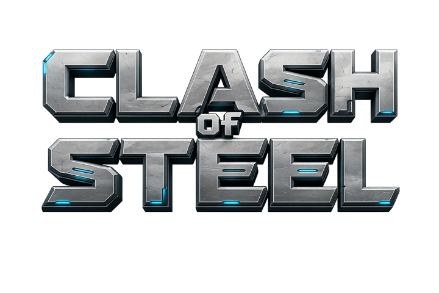
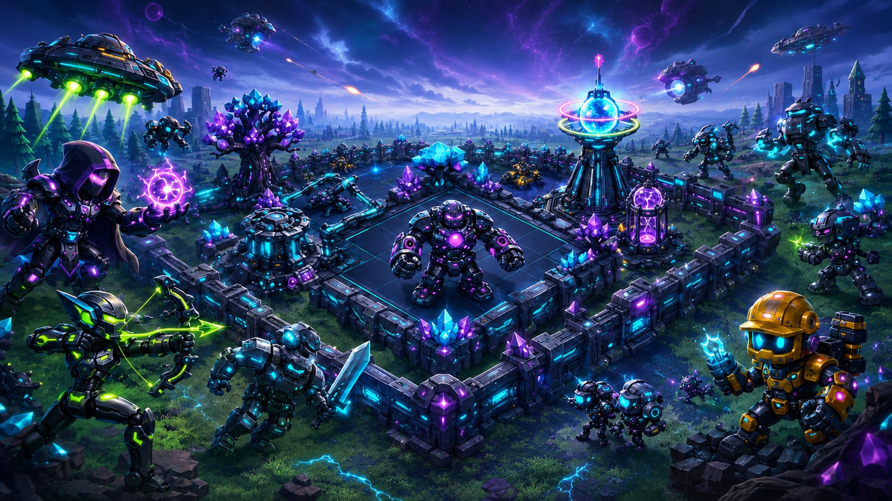

<p align="center">
  
</p>

<h1 align="center">⚔️ CLASH OF STEEL</h1>

<p align="center">
  <b>Forge your steel empire. Command your mechs. Clash for the galaxy.</b><br/>
  An original 3D real-time strategy &amp; base-building game set in a neon galaxy of war machines. 🤖
</p>

<p align="center">
  <a href="https://clashofsteel.xyz"></a>
</p>

<p align="center">
  
  
  
  
  
</p>

<p align="center">
  
</p>

---

## 🌌 About

**Clash of Steel** is an original real-time strategy game where you build a robot war-base on a distant steel world, raise an army of battle-mechs, and clash with rival commanders for galactic dominance. Every base you raise is a fortress to defend; every attack is a fully animated 3D showdown.

Jump in instantly as a guest, or connect your Solana wallet to claim your commander and rise through the ranks. The galaxy is yours to conquer. 🚀

## ✨ Features

- 🏰 **Base Building** — Lay out and upgrade your Command Core, production structures, defenses, and walls on a living 3D battlefield.
- ⚙️ **Resource Economy** — Mine **Scrap** and **Plasma**, manage your storage, and keep your war machine fueled and growing.
- 🤖 **Mech Army** — Train a roster of distinct units — Fighters, Archers, Mages, heavy Titans, and airborne War Jets — each with its own role in battle.
- 🛡️ **Layered Defenses** — Fortify with Rail Cannons, Laser Turrets, and Bomber Spires that light up the field with energy fire.
- ⚔️ **Real-Time 3D Battles** — Deploy your troops and watch fully animated clashes unfold. Earn stars, loot, and trophies for every victory.
- 🏆 **PvP Raids & Leagues** — Scout and attack other commanders, climb the trophy ladder, and rise up the global leaderboard.
- 🗺️ **Campaign Mode** — Battle through a series of single-player missions with steadily escalating challenge.
- 👥 **Clans & Clan Wars** — Team up, chat with allies, and wage organized wars for clan glory.
- 💎 **Gems, Quests & Daily Rewards** — Complete goals, claim daily bonuses, and accelerate your rise to the top.
- 🎬 **Immersive World** — A handcrafted 3D galaxy with dynamic day/night skies, particle effects, camera shake, and a full original soundtrack.
- 🔗 **Solana-Powered ($COS)** — Connect your wallet for a persistent commander, or play instantly as a guest.

## 🎮 How to Play

1. **Enter the galaxy** — Connect your Solana wallet (Phantom · Solflare · Backpack) or jump in as a guest.
2. **Build your base** — Place and upgrade producers, storage, defenses, and your Command Core.
3. **Collect & grow** — Gather Scrap and Plasma to fund new buildings and upgrades.
4. **Train your army** — Unlock and queue mech units at your Mech Bay.
5. **Raid & conquer** — Attack rival bases or take on the campaign; deploy your troops in real-time 3D battles for stars and loot.
6. **Defend & dominate** — Strengthen your defenses, join a clan, win wars, and climb the leaderboard. 🏆

> 💡 **Tip:** A balanced army and a smart base layout win wars. Scout your target before you strike!

## 🛠️ Tech Stack

| Layer | Tech |
|---|---|
| **Frontend** | React · TypeScript · Three.js · Vite |
| **State** | Zustand |
| **Backend** | Node.js game server |
| **Blockchain** | Solana wallet integration ($COS) |

## 🚀 Getting Started (Local Development)

```bash
# install dependencies
npm install

# start the dev environment
npm run dev
```

Then open the local URL shown in your terminal and start building. 🎮

## 🗺️ Roadmap

- [ ] More mech units, defenses, and base themes
- [ ] New campaign chapters & boss encounters
- [ ] Clan leagues, tournaments & seasonal events
- [ ] Enhanced battle replays & spectator mode
- [ ] Cosmetic customization for bases and units
- [ ] Expanded $COS rewards & utility
- [ ] Mobile-optimized controls

## 🔗 Links

- 🎮 **Play:** [clashofsteel.xyz](https://clashofsteel.xyz)
- 🐦 **X:** [@clashofsteel](https://x.com/clashofsteel)
- 💬 **Telegram:** [t.me/clashofsteel](https://t.me/clashofsteel)

---

<p align="center">
  Forge your empire. Command your mechs. <b>Clash for the galaxy.</b> ⚔️🤖
</p>
